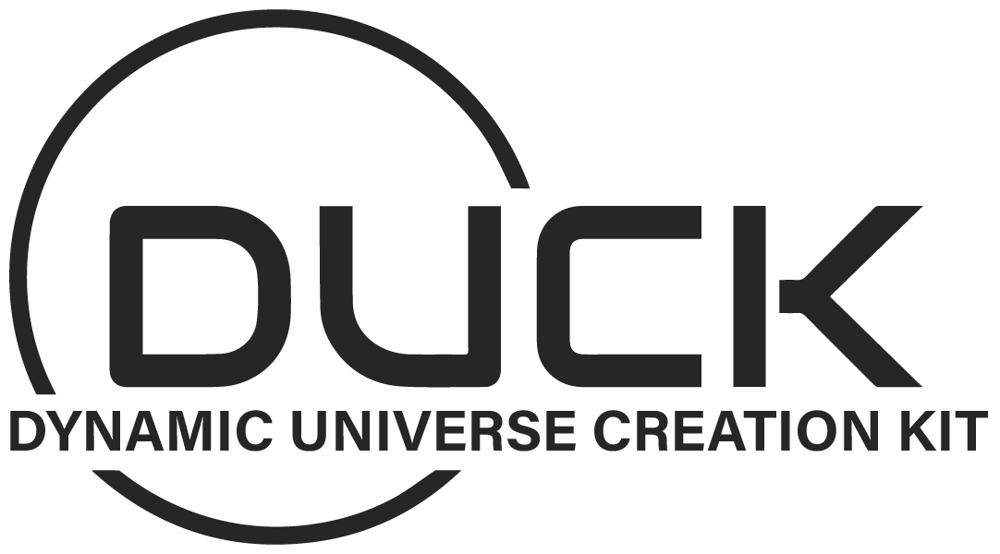

# Duck

## Cross-Platform Game Engine
Duck is a cross-platform game engine for creating 2D and 3D games. Uses an ECS system and native scripting. Supports major desktop platforms including Linux, macOS, and Windows.

## :star: Features
- [x] Support for Windows, Mac, and Linux
- [x] Advanced 3D/2D Rendering
- [x] Entity Component System/Native Scripting
- [x] Resource Manager
- [ ] UI Rendering
- [ ] Debug Gizmos/Inspector
- [ ] 3D Audio System
- [ ] Particles/Line Renderer
- [ ] Animations/Skeletal Animation
- [ ] PBR Rendering/Materials
- [ ] Integrated Physics
- [ ] Networking

## :wrench: Getting Started

### Prerequisites
- CMake
- Compiler support for C++20
- OpenGL 4.3 supported video card

### Building

## :mag: Documentation
The official documentation is hosted on [Duck Wiki](https://github.com/artak10t/Duck/wiki).

## :clipboard: Meta

Spartak Gevorgyan – artak10t@gmail.com

Distributed under the MIT License. See ``MIT License`` for more information.

[https://github.com/artak10t/github-link](https://github.com/artak10t/)
